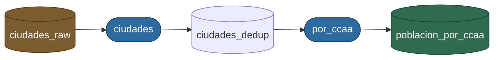

# ETL de CSV

ETL minima sobre CSV con PySpark: lectura, checks de calidad, deduplicacion y
escritura. Vive en el paquete `etl_kedro/`, aparte de `devel0pez/` (la libreria con las
demos y el caso base de compatibilidad de la plantilla).

```
etl_kedro/
├── main.py                  # CLI con argparse + codigos de salida
├── core/                    # maquinaria reutilizable: no sabe de ningun dato
│   ├── pipeline.py          # ETLPipeline: read_csv / transform / write_csv
│   ├── quality.py           # checks de calidad y deduplicacion
│   ├── datasets.py          # el tipo Dataset + comprobacion de rutas
│   ├── session.py           # backend, Java y creacion de la sesion
│   └── logging_conf.py      # setup_logging con dictConfig
├── graph.py                 # deriva la cadena de jobs y la pinta
├── dryrun.py                # revisa el plan en seco, sin arrancar Spark
└── jobs/
    ├── ciudades/            # un flujo = una carpeta autocontenida
    │   ├── datasets.py      # sus datasets, con esquema (entrada Y salida)
    │   ├── transform.py     # dominio puro: DataFrame -> DataFrame
    │   └── job.py           # CONSUME / PRODUCE + orquestacion
    └── por_ccaa/            # consume la salida de `ciudades`
        ├── datasets.py
        ├── transform.py
        └── job.py
```

El corte es **por dominio**, no por rol tecnico: todo lo que necesitas para
entender un flujo esta en su carpeta. Anadir un job es anadir una carpeta.

### La cadena entre jobs

Cada job declara que consume y que produce, y la dependencia se escribe como un
import normal:

```python
# etl_kedro/jobs/ventas/job.py
from etl_kedro.jobs.ciudades.datasets import CIUDADES_DEDUP

CONSUME = (CIUDADES_DEDUP,)
```

Ese import *es* el enlace. El IDE lo navega, mypy lo verifica y "buscar usos" te
da los consumidores de un dataset al instante, con 3 jobs o con 300. Un catalogo
central en un unico fichero daria lo mismo en peor: crece sin limite, provoca
conflictos de merge y ninguna herramienta lo entiende.

### Ver el grafo

La foto global no se mantiene a mano: se deriva recorriendo `etl_kedro.jobs` y leyendo
lo que cada job declara, asi que no se puede desincronizar.

```bash
python -m etl_kedro.graph
```

```
ciudades
  <- ciudades_raw           resources/ciudades_espana.csv  (externo)
  -> ciudades_dedup         data/ciudades_dedup

por_ccaa
  <- ciudades_dedup         data/ciudades_dedup  (de ciudades)
  -> poblacion_por_ccaa     data/poblacion_por_ccaa

Cadena:
  ciudades -> por_ccaa   (ciudades_dedup)

Entradas externas: ciudades_raw
Salidas finales:   poblacion_por_ccaa
```

Con `--format mermaid` sale el mismo grafo como diagrama, que GitHub renderiza
aqui mismo:

```bash
python -m etl_kedro.graph --format mermaid
```



Azul los jobs, ambar la entrada que no produce nadie y verde la salida que no
consume nadie. El color sale de `entradas_externas` y `salidas_finales`, no esta
pintado a mano.

`tests/etl_kedro/test_graph.py` vigila la cadena sin ejecutar nada: que todo job
declare `CONSUME`/`PRODUCE`, que ningun dataset lo produzcan dos jobs, que el
enlace entre ambos siga existiendo y que las dos vistas nombren los mismos
datasets.

## Ejecutar la ETL

```bash
# La cadena entera, en orden de dependencia y en una sola sesion de Spark.
# Usa las rutas declaradas en los datasets de cada job.
python -m etl_kedro.main --all

# Un job suelto (por defecto, `ciudades`).
python -m etl_kedro.main --job ciudades
python -m etl_kedro.main --job por_ccaa

# Con rutas propias, que sobrescriben las del catalogo.
python -m etl_kedro.main --job ciudades --input resources/ciudades_espana.csv --output /tmp/salida
```

`--input` y `--output` son opcionales: sin ellos se usan las rutas que declara
el dataset del job. Con `--all` no se admiten, porque una sola pareja de rutas
no tiene sentido para una cadena de N jobs.

Con una `--key-col` que no exista, la ETL falla en el check de calidad, sale con
codigo 2 y no escribe nada.

### Ensayo en seco (`--dry-run`)

Antes de lanzar, `--dry-run` responde a dos preguntas que en produccion no
conviene contestar a mitad de ejecucion: **en que orden y contra que rutas** va a
correr, y **si los esquemas y las entradas cuadran**. No arranca Spark ni escribe
nada, asi que tarda milisegundos:

```bash
python -m etl_kedro.main --all --dry-run
ETL_ENV=pro ETL_DATA_ROOT=s3://mi-bucket/oro python -m etl_kedro.main --all --dry-run
```

```
Plan (entorno=pro, raiz=s3://mi-bucket/oro)

1. ciudades
     lee     ciudades_raw           s3://mi-bucket/oro/resources/ciudades_espana.csv
     escribe ciudades_dedup         s3://mi-bucket/oro/data/ciudades_dedup
2. por_ccaa
     lee     ciudades_dedup         s3://mi-bucket/oro/data/ciudades_dedup
     escribe poblacion_por_ccaa     s3://mi-bucket/oro/data/poblacion_por_ccaa

Sin problemas: esquemas coherentes y entradas presentes.
```

Comprueba que no haya ciclos, que nadie declare el mismo dataset con dos rutas o
dos esquemas, que las entradas externas existan y que la cabecera real del CSV
traiga las columnas del `StructType` declarado. La cabecera se lee con el `csv`
de Python, sin motor. Si algo falla lo lista y sale con codigo 6:

```
1 problema(s):
  [ciudades_raw] al fichero le faltan columnas declaradas ['habitantes', 'provincia']; tiene ['ciudad', 'poblacion']
```

Que los esquemas cuadren **entre jobs** se cumple por construccion, porque el
consumidor importa el objeto `Dataset` del productor: es el mismo objeto. Lo que
vigila el dry-run es que nadie se salte esa regla redeclarandolo por su cuenta.
Los `s3://` no se miran en seco: se dejan pasar en vez de dar un falso error.

### Entornos y rutas

La configuracion son dos variables de entorno, no ficheros:

| Variable         | Por defecto | Descripcion                                            |
| ---------------- | ----------- | ------------------------------------------------------ |
| `ETL_ENV`        | `dev`       | `dev`, `pre` o `pro`                                   |
| `ETL_DATA_ROOT`  | `.` en dev  | Raiz de la que cuelgan las rutas relativas             |

Los datasets declaran ruta **relativa** y `Config.resolver` le antepone la raiz,
asi que el mismo codigo escribe en local o en el bucket sin tocar nada:

```bash
python -m etl_kedro.main --all                                      # dev: ./data/...
ETL_ENV=pro ETL_DATA_ROOT=s3://mi-bucket/oro python -m etl_kedro.main --all
```

Fuera de `dev` la raiz es **obligatoria**: sin `ETL_DATA_ROOT` la ETL corta con
codigo 5 en vez de arrancar y escribir en el sitio equivocado. Una ruta absoluta
o un URI en el dataset escapan de la raiz, para origenes fijos.

Tambien queda instalado como comando (`pip install -e .`):

```bash
etl-kedro --all
etl-kedro --job por_ccaa
```

### Argumentos

| Argumento     | Por defecto | Descripcion                                                  |
| ------------- | ----------- | ------------------------------------------------------------ |
| `--all`       | `false`     | Ejecuta todos los jobs en orden de dependencia                 |
| `--dry-run`   | `false`     | Muestra el plan y revisa esquemas y entradas, sin ejecutar      |
| `--job`       | `ciudades`  | Job a ejecutar; los nombres salen de las carpetas de `jobs/`   |
| `--input`     | del dataset | Sobrescribe la ruta de entrada; incompatible con `--all`       |
| `--output`    | del dataset | Sobrescribe la ruta de salida; incompatible con `--all`        |
| `--mode`      | `overwrite` | `overwrite` o `append`                                         |
| `--key-col`   | del job     | Columna clave: sin nulos y usada para deduplicar               |
| `--log-level` | `INFO`      | `DEBUG`, `INFO`, `WARNING` o `ERROR`                           |

### Logs y datos van por canales distintos

Los logs salen por **stderr** y lo que imprime el proceso por **stdout**. Asi se
puede redirigir uno sin arrastrar el otro:

```bash
python -m etl_kedro.main --all 2> etl_kedro.log     # logs al fichero, terminal limpia
python -m etl_kedro.main --all 2>/dev/null    # sin logs
python -m etl_kedro.graph --format mermaid | pbcopy   # esto si va por stdout
```

Ojo con `python -m etl_kedro.main --all | pbcopy`: no copia nada, porque por stdout no
sale ni un byte. Para capturar los logs hace falta `2>&1 |`.

### Pasos y logs

La CLI loguea cada etapa (`read`, `validate`, `dedup`, `write`), incluyendo
cuantos duplicados se han eliminado:

El nombre del logger dice de que capa sale cada linea: `etl_kedro.main` la CLI,
`etl_kedro.core.*` la maquinaria y `etl_kedro.jobs.<dominio>.job` el flujo concreto.

```
| INFO | etl_kedro.main                | ETL iniciada: input=resources/ciudades_espana.csv output=/tmp/salida
| INFO | etl_kedro.core.session        | Iniciando sesion de Spark (backend=pysail)
| INFO | etl_kedro.jobs.ciudades.job   | == read == resources/ciudades_espana.csv
| INFO | etl_kedro.core.pipeline       | CSV leido con columnas ['ciudad', 'habitantes', 'provincia', ...]
| INFO | etl_kedro.jobs.ciudades.job   | == validate == clave 'provincia'
| INFO | etl_kedro.core.pipeline       | Aplicando transformacion validar
| INFO | etl_kedro.jobs.ciudades.job   | == dedup == por 'provincia'
| INFO | etl_kedro.core.pipeline       | Aplicando transformacion deduplicar
| INFO | etl_kedro.jobs.ciudades.job   | Deduplicado: 100 filas -> 42 filas (58 duplicados eliminados)
| INFO | etl_kedro.jobs.ciudades.job   | == write == /tmp/salida (mode=overwrite)
| INFO | etl_kedro.main                | ETL finalizada correctamente
```

Codigos de salida:

| Codigo | Significado                                                  |
| ------ | ------------------------------------------------------------ |
| `0`    | Correcto                                                       |
| `1`    | Error inesperado (se loguea con traceback)                     |
| `2`    | Fallo de un check de calidad (`QualityCheckError`)             |
| `3`    | Backend invalido o sin Java (`BackendError`)                   |
| `4`    | La ruta de `--input` no existe (`FileNotFoundError`)           |
| `5`    | Configuracion de entorno invalida (`ConfigError`)              |
| `6`    | El `--dry-run` ha encontrado problemas                         |

Los fallos de dato y de entorno salen como una linea de `ERROR` con el motivo,
sin traceback: no son bugs, son el dato o el entorno. El traceback se reserva
para el codigo `1`.

La entrada se comprueba antes de arrancar Spark. Sin eso, una ruta mal escrita
se lee como un DataFrame vacio y el error que sale es "faltan columnas
requeridas", que manda a depurar el esquema en vez de la ruta. Los URI
(`s3://...`) y los patrones con comodines se dejan pasar: los resuelve el motor.

### Backend

Como el resto del repositorio, la sesion se elige con `SPARK_BACKEND`:

```bash
python -m etl_kedro.main ...                        # pysail (por defecto, sin Java)
SPARK_BACKEND=pyspark python -m etl_kedro.main ...  # PySpark local (requiere Java)
```

Un valor desconocido es un error, no un silencioso "pues pysail": si escribes
`pysprak` la ETL corta con codigo 3 en vez de correr en Sail y dar por buena una
prueba de PySpark que nunca ocurrio. `tests/conftest.py` valida lo mismo antes de
lanzar la suite. Y si pides `pyspark` sin Java (por ejemplo en el shell
`nix develop .#pysail`), el mensaje lo dice en vez del `JAVA_GATEWAY_EXITED`.

## Usar el pipeline desde codigo

```python
from etl_kedro.core.pipeline import ETLPipeline
from etl_kedro.core.quality import check_non_null_key, deduplicate_by_key

(
    ETLPipeline(spark)
    .read_csv("entrada.csv")
    .transform(lambda df: check_non_null_key(df, "id"))
    .transform(lambda df: deduplicate_by_key(df, "id", keep="first"))
    .write_csv("/tmp/salida", mode="overwrite")
)
```

Los metodos devuelven el pipeline para poder encadenar. Pedir `df`, `transform`
o `write_csv` antes de un `read_csv` lanza `PipelineStateError`.

### Checks de calidad

Todas las funciones de `etl_kedro.core.quality` reciben y devuelven un `DataFrame`, asi que
se pueden encadenar y usar directamente dentro de `transform`:

- `check_required_columns(df, required_cols)` — lanza `QualityCheckError` con la
  lista de columnas que faltan.
- `check_non_null_key(df, key_col)` — lanza `QualityCheckError` indicando cuantos
  nulos hay en la clave.
- `deduplicate_by_key(df, key_col, keep="first")` — deja una fila por clave;
  `keep` admite `"first"` o `"last"`.

## Tests

Los tests usan la fixture `spark` de `tests/conftest.py`, que levanta una sesion
local con el backend configurado.

El arbol de `tests/etl_kedro/` refleja el de `etl_kedro/`: `core/` para la maquinaria,
`jobs/<dominio>/` para cada flujo, y `test_main.py` / `test_graph.py` sueltos.

```bash
# Solo los tests de la ETL
pytest tests/etl_kedro -v

# Solo un job, o solo el grafo
pytest tests/etl_kedro/jobs/ciudades -v
pytest tests/etl_kedro/test_graph.py -v

# Toda la suite, con los dos backends
pytest -v
SPARK_BACKEND=pyspark pytest -v
```

Los de `test_graph.py` no levantan Spark: leen lo que declara cada job, asi que
corren en centesimas y sirven de verificacion barata de la cadena.

## Calidad de codigo

Dentro del shell de Nix las herramientas ya estan en el `PATH`:

```bash
pytest -v                                    # tests
mypy etl_kedro tests                               # tipos
ruff check .                                 # lint
pytest --cov=etl_kedro --cov-report=term-missing   # cobertura
```

Los mismos comandos estan envueltos como scripts de hatch, para lanzarlos igual
fuera del shell de Nix:

```bash
hatch run test
hatch run typecheck
hatch run lint
hatch run test-cov
```

## Nota sobre `inferSchema`

Sail y PySpark no infieren los enteros igual: para un CSV con valores pequenos,
PySpark devuelve `int` y Sail `bigint` (el resto de tipos —`double`, `string`,
`date`— coinciden). Si el esquema importa (por ejemplo para un `insertInto`),
pasa un `StructType` explicito en vez de confiar en `inferSchema`:

```python
pipeline.read_csv("entrada.csv", schema=MI_ESQUEMA, inferSchema=False)
```
